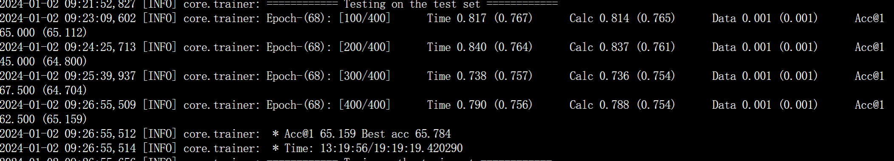

# LFS11实验报告

分工和成员按照要求写在了该文件夹之外的LFS11_不增不减\.pdf中

## 一 DeepEMD论文理解

​		目前小样本学习领域，度量学习依然是一大热门。大部分度量学习都是先用CNN提取图片特征，然后用一个距离度量函数（比如余弦距离，欧氏距离）进行分类。

 	本论文是以典型的度量学习为基础的。通过DeepEMD，CrossReference，SFC等创新性的方法，优化了原有的度量学习。

​		整体流程：先对 support和query 提取局部embedding，然后计算EMD（EarthMoveDistance），然后根据这个距离进行分类。

### 1 EMD 算法


​	总的来说，就是从图像子区域之间的最优匹配的角度，计算两个图片之间的相似度		

​	第一步是对图片进行取样，提取特征，（文章选取了三种方式：FCN，Grid，Sampling），得到了两张图片的embedding之后，计算两张图片之间的EMD。

​	 假设每个集中都有U×V个向量，假设任意两幅图的embedding nodes为 $ u_i,v_i $ ， 则每个单位的cost的计算过程如下：则每个单位的cost的计算过程如下：$ c(i, j)=1-\frac{\mathbf{u}_i^T \mathbf{v}_j}{\left\|\mathbf{u}_i\right\|\left\|\mathbf{v}_j\right\|}$ ，代表着两张图片中的每对单位之间要Move到一起所产生的cost。然后通过一个线性规划问题的求解，即可求得出两张图片之间的最佳运输矩阵$\widetilde{X}$ 。进一步就可得到两张图片的相似度$s(\mathbf{U}, \mathbf{V})=\sum_{i=1}^{H W} \sum_{j=1}^{H W}\left(1-c_{i j}\right) \tilde{x}_{i j}$ 。

​	接下来就可以利用这个相似度进行分类。

### 2 权重获取（CrossReference 交叉参照原理）

​	彩色图片修复领域，通常颜色越占主导地位，像素越多的nodes会得到越大的权重。但是在小样本领域，像素越多不一定能够反映越多信息，图片中包含了许多高级的语义信息。所以很自然地能想到，既然要提取语义信息，那就得区分前景和背景。相对来说，前景肯定包含更多语义信息，故而更重要。那么怎么找到前景？两张图片中共同出现的区域更可能是前景。

​	于是本文提出了交叉参照原理,在这个交叉参照机制中，在决定每个节点的权重时，我们通过将该节点与另一张图片的全局统计量进行比较，来决定。

​	简单来说，就是与另一个图像显现出更高相关性的图像更有可能是目标区域，所以需要给予更高的权重。相对的，对于拥有高方差的背景区域和在两张图像中不同时出现的目标部分则需要降低他们的权重。

​	算法过程：

​	假设$u_i$和$u_j$分别表示从两个特征映射中提出的两个向量：则一张图片中的权值  $s_i=\max \left\{\mathbf{u}_i^T \cdot \frac{\sum_{j=1}^{H W} \mathbf{v}_j}{H W}, 0\right\}$  ,（0是为了保证权值非负），然后对权值进行归一化，让两张图片想对照的权值相同。

### 3 Structured Fully Connected Layer


​	对于K-shot的情况，常规方法是使用FC层，为每个类找到一个原型向量，这样就可以使用距离度量来对图像进行分类。而为了使用EMD作为距离度量函数，文章 训练了一个结构化的全连接层，该层采用 EMD 作为距离函数来直接对结构化特征表示进行分类。每个类别的可学习参数变成一组向量，而不是一个向量，这样我们就可以使用结构距离函数 EMD 来进行图像分类。

​	具体流程如下：


## 二 实现内容和复现难点

### 代码仓库

> 其中一个也是最终代码存储的仓库地址
>
> [shengyuand/deepemd (gitee.com)](https://gitee.com/shengyuand/deepemd)

### config

 

deepemd_pretrain.yaml是预训练用的配置文件

deepemd.yaml是使用metric-based训练方法进一步训练的配置文件


### core/backbone/resnet_emd.py（骨架代码）

按照仓库的手册要求，我们自己创建了classifier和backbone，这个文件存储的就是backbone。

deepemd所使用的backbone基本就是resnet12，但是有点细微的区别，因此实现了resnet_emd.py


### core/model/finetuning/deepemd.py

这个文件进行的工作是书写classifier，详细代码如下：

```python
import argparse
import torch
from torch import nn
from torch.nn import functional as F

from core.utils import accuracy
from .metric_model import MetricModel
from .emd_utils import *

import numpy as np

# fake args
DATA_DIR = '/home/zhengxiawu/work/dataset'
PRETRAIN_DIR = '/root/autodl-tmp/ml/deepemd_pretrain_model/miniimagenet/resnet12/max_acc.pth'


class DeepEMDLayer(nn.Module):
    def __init__(self, args, resnet12emd, mode='meta'):
        super().__init__()

        self.mode = mode

        self.args = args

        self.encoder = resnet12emd

        print('self.args.pretrain:')
        print(self.args.pretrain)

        if self.args.pretrain == 'origin':
            # 打印encoder的state_dict的keys
            print('encoder.state_dict().keys():',
                  self.encoder.state_dict().keys())
            load_model(self.encoder, PRETRAIN_DIR)

        if self.mode == 'pre_train':
            print('self.mode', self.mode)
            self.fc = nn.Linear(640, self.args.num_classes)

    def forward(self, input):
        if self.mode == 'meta':
            support, query = input
            return self.emd_forward_1shot(support, query)

        elif self.mode == 'pre_train':
            return self.pre_train_forward(input)

        elif self.mode == 'encoder':
            if self.args.deepemd == 'fcn':
                dense = True
            else:
                dense = False
            return self.encode(input, dense)
        else:
            raise ValueError('Unknown mode')

    def pre_train_forward(self, input):
        return self.fc(self.encode(input, dense=False).squeeze(-1).squeeze(-1))

    def get_weight_vector(self, A, B):

        M = A.shape[0]
        N = B.shape[0]

        B = F.adaptive_avg_pool2d(B, [1, 1])
        B = B.repeat(1, 1, A.shape[2], A.shape[3])

        A = A.unsqueeze(1)
        B = B.unsqueeze(0)

        A = A.repeat(1, N, 1, 1, 1)
        B = B.repeat(M, 1, 1, 1, 1)

        combination = (A * B).sum(2)
        combination = combination.view(M, N, -1)
        combination = F.relu(combination) + 1e-3
        return combination

    def emd_forward_1shot(self, proto, query):
        proto = proto.squeeze(0)

        weight_1 = self.get_weight_vector(query, proto)
        weight_2 = self.get_weight_vector(proto, query)

        proto = self.normalize_feature(proto)
        query = self.normalize_feature(query)

        similarity_map = self.get_similiarity_map(proto, query)
        if self.args.solver == 'opencv' or (not self.training):
            logits = self.get_emd_distance(
                similarity_map, weight_1, weight_2, solver='opencv')
        else:
            logits = self.get_emd_distance(
                similarity_map, weight_1, weight_2, solver='qpth')
        return logits

    def get_sfc(self, support):
        support = support.squeeze(0)
        # init the proto
        SFC = support.view(self.args.shot, -1, 640,
                           support.shape[-2], support.shape[-1]).mean(dim=0).clone().detach()
        SFC = nn.Parameter(SFC.detach(), requires_grad=True)

        optimizer = torch.optim.SGD(
            [SFC], lr=self.args.sfc_lr, momentum=0.9, dampening=0.9, weight_decay=0)

        # crate label for finetune
        label_shot = torch.arange(self.args.way).repeat(self.args.shot)
        label_shot = label_shot.type(torch.cuda.LongTensor)

        with torch.enable_grad():
            for k in range(0, self.args.sfc_update_step):
                rand_id = torch.randperm(self.args.way * self.args.shot).cuda()
                for j in range(0, self.args.way * self.args.shot, self.args.sfc_bs):
                    selected_id = rand_id[j: min(
                        j + self.args.sfc_bs, self.args.way * self.args.shot)]
                    batch_shot = support[selected_id, :]
                    batch_label = label_shot[selected_id]
                    optimizer.zero_grad()
                    logits = self.emd_forward_1shot(SFC, batch_shot.detach())
                    loss = F.cross_entropy(logits, batch_label)
                    loss.backward()
                    optimizer.step()
        return SFC

    def get_emd_distance(self, similarity_map, weight_1, weight_2, solver='opencv'):
        num_query = similarity_map.shape[0]
        num_proto = similarity_map.shape[1]
        num_node = weight_1.shape[-1]

        if solver == 'opencv':  # use openCV solver

            for i in range(num_query):
                for j in range(num_proto):
                    _, flow = emd_inference_opencv(
                        1 - similarity_map[i, j, :, :], weight_1[i, j, :], weight_2[j, i, :])

                    similarity_map[i, j, :, :] = (
                        similarity_map[i, j, :, :])*torch.from_numpy(flow).cuda()

            temperature = (self.args.temperature / num_node)
            logitis = similarity_map.sum(-1).sum(-1) * temperature
            return logitis

        elif solver == 'qpth':
            weight_2 = weight_2.permute(1, 0, 2)
            similarity_map = similarity_map.view(num_query * num_proto, similarity_map.shape[-2],
                                                 similarity_map.shape[-1])
            weight_1 = weight_1.view(num_query * num_proto, weight_1.shape[-1])
            weight_2 = weight_2.reshape(
                num_query * num_proto, weight_2.shape[-1])

            _, flows = emd_inference_qpth(
                1 - similarity_map, weight_1, weight_2, form=self.args.form, l2_strength=self.args.l2_strength)

            logitis = (flows*similarity_map).view(num_query,
                                                  num_proto, flows.shape[-2], flows.shape[-1])
            temperature = (self.args.temperature / num_node)
            logitis = logitis.sum(-1).sum(-1) * temperature
        else:
            raise ValueError('Unknown Solver')

        return logitis

    def normalize_feature(self, x):
        if self.args.norm == 'center':
            x = x - x.mean(1).unsqueeze(1)
            return x
        else:
            return x

    def get_similiarity_map(self, proto, query):
        way = proto.shape[0]
        num_query = query.shape[0]
        query = query.view(query.shape[0], query.shape[1], -1)
        proto = proto.view(proto.shape[0], proto.shape[1], -1)

        proto = proto.unsqueeze(0).repeat([num_query, 1, 1, 1])
        query = query.unsqueeze(1).repeat([1, way, 1, 1])
        proto = proto.permute(0, 1, 3, 2)
        query = query.permute(0, 1, 3, 2)
        feature_size = proto.shape[-2]

        if self.args.metric == 'cosine':
            proto = proto.unsqueeze(-3)
            query = query.unsqueeze(-2)
            query = query.repeat(1, 1, 1, feature_size, 1)
            similarity_map = F.cosine_similarity(proto, query, dim=-1)
        if self.args.metric == 'l2':
            proto = proto.unsqueeze(-3)
            query = query.unsqueeze(-2)
            query = query.repeat(1, 1, 1, feature_size, 1)
            similarity_map = (proto - query).pow(2).sum(-1)
            similarity_map = 1 - similarity_map

        return similarity_map

    def encode(self, x, dense=True):

        if x.shape.__len__() == 5:  # batch of image patches
            num_data, num_patch = x.shape[:2]
            x = x.reshape(-1, x.shape[2], x.shape[3], x.shape[4])
            x = self.encoder(x)
            x = F.adaptive_avg_pool2d(x, 1)
            x = x.reshape(num_data, num_patch,
                          x.shape[1], x.shape[2], x.shape[3])
            x = x.permute(0, 2, 1, 3, 4)
            x = x.squeeze(-1)
            return x

        else:
            x = self.encoder(x)
            if dense == False:
                x = F.adaptive_avg_pool2d(x, 1)
                return x
            if self.args.feature_pyramid is not None:
                x = self.build_feature_pyramid(x)
        return x

    def build_feature_pyramid(self, feature):
        feature_list = []
        feature_pyramid = [int(size)
                           for size in self.args.feature_pyramid.split(',')]
        for size in feature_pyramid:
            feature_list.append(F.adaptive_avg_pool2d(feature, size).view(
                feature.shape[0], feature.shape[1], 1, -1))
        feature_list.append(feature.view(
            feature.shape[0], feature.shape[1], 1, -1))
        out = torch.cat(feature_list, dim=-1)
        return out


class DeepEMD(MetricModel):
    def __init__(self, args, mode, **kwargs):
        # 调用父类的构造函数
        super(DeepEMD, self).__init__(**kwargs)

        # 解析参数，这里偷懒了，直接用了argparse 呃呃
        self.args = argparse.Namespace()
        self.args.dataset = args.get('dataset', 'miniimagenet')
        self.args.data_dir = args.get('data_dir', DATA_DIR)
        self.args.set_val = args.get('set', 'val')

        # about training
        self.args.bs = args.get('bs', 1)
        self.args.max_epoch = args.get('max_epoch', 100)
        self.args.lr = args.get('lr', 0.0005)
        self.args.temperature = args.get('temperature', 12.5)
        self.args.step_size = args.get('step_size', 10)
        self.args.gamma = args.get('gamma', 0.5)
        self.args.val_frequency = args.get('val_frequency', 50)
        self.args.random_val_task = args.get('random_val_task', False)
        self.args.save_all = args.get('save_all', False)

        # about task
        self.args.way = args.get('way', 5)
        self.args.shot = args.get('shot', 1)
        self.args.query = args.get('query', 15)
        self.args.val_episode = args.get('val_episode', 1000)
        self.args.test_episode = args.get('test_episode', 5000)

        # about model
        self.args.pretrain_dir = args.get('pretrain_dir', PRETRAIN_DIR)
        self.args.metric = args.get('metric', 'cosine')
        self.args.norm = args.get('norm', 'center')
        self.args.deepemd = args.get('deepemd', 'fcn')
        self.args.feature_pyramid = args.get('feature_pyramid', None)
        self.args.num_patch = args.get('num_patch', 9)
        self.args.patch_list = args.get('patch_list', '2,3')
        self.args.patch_ratio = args.get('patch_ratio', 2)

        # solver about
        self.args.solver = args.get('solver', 'opencv')
        self.args.form = args.get('form', 'L2')
        self.args.l2_strength = args.get('l2_strength', 0.000001)

        # SFC
        self.args.sfc_lr = args.get('sfc_lr', 0.1)
        self.args.sfc_wd = args.get('sfc_wd', 0)
        self.args.sfc_update_step = args.get('sfc_update_step', 100)
        self.args.sfc_bs = args.get('sfc_bs', 4)

        # OTHERS
        self.args.gpu = args.get('gpu', '0,1')
        self.args.extra_dir = args.get('extra_dir', None)
        self.args.seed = args.get('seed', 1)

        # add
        self.args.num_classes = args.get('num_classes', 64)
        self.args.way = args.get('way', 5)
        self.args.shot = args.get('shot', 1)
        self.args.query = args.get('query', 16)
        self.args.pretrain = args.get('pretrain', 'origin')

        # print('self.args.pretrain:', self.args.pretrain)
        # 使用logger

        self.mode = mode

        self.deepemd_layer = DeepEMDLayer(
            args=self.args, mode=self.mode, resnet12emd=self.emb_func)
        self.loss_func = nn.CrossEntropyLoss()      # tag:不确定是不是这个损失函数

    def set_forward_loss(self, batch):

        data, global_target = batch
        # print('global_targey:', global_target)

        # 打印data的shape 5*(1+16)张3,84,84 C H W
        # print('data.shape:', data.shape)

        # key: 重新排列数组
        # 重排数据
        new_data = torch.empty((data.size(0), data.size(
            1), data.size(2), data.size(3)), dtype=data.dtype)

        # 重新排列数据
        for i in range(self.args.way):
            for j in range(self.args.shot + self.args.query):
                if j < self.args.shot:
                    new_index = j * self.args.way + i
                else:
                    new_index = self.args.shot * self.args.way + \
                        (j - self.args.shot) * self.args.way + i
                new_data[new_index] = data[i *
                                           (self.args.shot + self.args.query) + j]

        data = new_data.to(self.device)

        data = data.to(self.device)

        # print('set_forward_loss')
        # print('way:', self.args.way)
        # print('shot:', self.args.shot)
        k = self.args.way * self.args.shot

        self.deepemd_layer.mode = 'encoder'
        data = self.deepemd_layer(data)

        data_shot, data_query = data[:k], data[k:]
        self.deepemd_layer.mode = 'meta'
        if self.args.shot > 1:
            data_shot = self.deepemd_layer.get_sfc(data_shot)

        num_gpu = 1  # tag:先固定了
        logits = self.deepemd_layer(
            (data_shot.unsqueeze(0).repeat(num_gpu, 1, 1, 1, 1), data_query))

        # 012340123401234...
        label = torch.arange(
            self.args.way, dtype=torch.int8).repeat(self.args.query)
        label = label.type(torch.LongTensor)
        label = label.to(self.device)

        loss = F.cross_entropy(logits, label)

        acc = accuracy(logits, label)

        # print('acc:', acc)

        return logits, acc, loss

    def set_forward(self, batch):
        data, global_target = batch
        # print('global_targey:', global_target)

        # 打印data的shape 5*(1+16)张3,84,84 C H W
        # print('data.shape:', data.shape)

        # key: 重新排列数组
        # 重排数据
        # new_data = torch.empty((data.size(0), data.size(
        #     1), data.size(2), data.size(3)), dtype=data.dtype)

        # # 重新排列数据
        # for i in range(self.args.way):
        #     for j in range(self.args.shot + self.args.query):
        #         if j < self.args.shot:
        #             new_index = j * self.args.way + i
        #         else:
        #             new_index = self.args.shot * self.args.way + \
        #                 (j - self.args.shot) * self.args.way + i
        #         new_data[new_index] = data[i *
        #                                    (self.args.shot + self.args.query) + j]

        # data = new_data.to(self.device)

        data = data.to(self.device)

        k = self.args.way * self.args.shot

        self.deepemd_layer.mode = 'encoder'
        data = self.deepemd_layer(data)

        # print('batch.image:', batch.image)
        # print('batch.image.shape:', batch.image.shape)
        # print('batch.label:', batch.label)
        # print('batch.label.shape:', batch.label.shape)

        data_shot, data_query = data[:k], data[k:]
        self.deepemd_layer.mode = 'meta'
        if self.args.shot > 1:
            data_shot = self.deepemd_layer.get_sfc(data_shot)

        num_gpu = 1  # tag:先固定了
        logits = self.deepemd_layer(
            (data_shot.unsqueeze(0).repeat(num_gpu, 1, 1, 1, 1), data_query))

        # 012340123401234...
        label = torch.arange(
            self.args.way, dtype=torch.int8).repeat(self.args.query)
        label = label.type(torch.LongTensor)
        label = label.to(self.device)

        acc = accuracy(logits, label)

        # print('acc:', acc)

        return logits, acc


def load_model(model, dir):
    model_dict = model.state_dict()
    print('loading model from :', dir)
    pretrained_dict = torch.load(dir)['params']
    # load from a parallel meta-trained model
    # 打印pretrained_dict的keys
    print('pretrained_dict.keys():', pretrained_dict.keys())

    if 'encoder' in list(pretrained_dict.keys())[0]:
        if 'module' in list(pretrained_dict.keys())[0]:
            pretrained_dict = {k[7:]: v for k, v in pretrained_dict.items()}
        else:
            pretrained_dict = {k: v for k, v in pretrained_dict.items()}
    else:
        # load from a pretrained model
        pretrained_dict = {'encoder.' + k: v for k,
                           v in pretrained_dict.items()}
    pretrained_dict = {k: v for k,
                       v in pretrained_dict.items() if k in model_dict}
    # update the param in encoder, remain others still
    model_dict.update(pretrained_dict)
    model.load_state_dict(model_dict)

    print('load model success')
    return model

```


### core/model/metric/deepemd_pretrain.py

参考feat_pretrain实现了原论文的pretrain

提取为deepemd_pretrain.py

### 复现关键部分1：注意重排

一开始我们无论怎么训练，前期的准确率都很低，重新阅读了源码后，我们通过**在deepEmd源代码中去除重排相关的部分**论证了数据必须要有重排。重排后，按照标签，数据的格式应该形如012340123401234……（重排之前是000……111……222……333……444……）

我们一开始的思路是在循环中进行重排：

关键代码如下，已加上注释

```python
    def set_forward(self, batch):
        """
        :param batch:
        :return:
        """
        data, global_target = batch
        # print('global_targey:', global_target)

        # 打印data的shape 5*(1+16)张3,84,84 C H W
        # print('data.shape:', data.shape)

        # key: 重新排列数组
        # 重排数据
        new_data = torch.empty((data.size(0), data.size(
            1), data.size(2), data.size(3)), dtype=data.dtype)

        # 重新排列数据
        for i in range(self.args.way):
            for j in range(self.args.shot + self.args.query):
                if j < self.args.shot:
                    new_index = j * self.args.way + i
                else:
                    new_index = self.args.shot * self.args.way + \
                        (j - self.args.shot) * self.args.way + i
                new_data[new_index] = data[i *
                                           (self.args.shot + self.args.query) + j]

        data = new_data.to(self.device)

        k = self.args.way * self.args.shot

        self.deepemd_layer.mode = 'encoder'
        data = self.deepemd_layer(data)

        # print('batch.image:', batch.image)
        # print('batch.image.shape:', batch.image.shape)
        # print('batch.label:', batch.label)
        # print('batch.label.shape:', batch.label.shape)

        data_shot, data_query = data[:k], data[k:]
        self.deepemd_layer.mode = 'meta'
        if self.args.shot > 1:
            data_shot = self.deepemd_layer.get_sfc(data_shot)

        num_gpu = 1  # tag:先固定了
        logits = self.deepemd_layer(
            (data_shot.unsqueeze(0).repeat(num_gpu, 1, 1, 1, 1), data_query))

        # 012340123401234...
        label = torch.arange(
            self.args.way, dtype=torch.int8).repeat(self.args.query)
        label = label.type(torch.LongTensor)
        label = label.to(self.device)

        acc = accuracy(logits, label)

        # print('acc:', acc)

        return logits, acc
```

以上是一个重排的例子，但是这么做显然的会增加一些时间成本。从而，考虑到上述问题，我们进行了一些修改，选择将重排直接在sampler中进行（这里可以考虑写一个针对性的采样器，但是我们考虑到实现的优先性，选择如下修改）：

```python
class CategoriesSampler(Sampler):
    """A Sampler to sample a FSL task.

    Args:
        Sampler (torch.utils.data.Sampler): Base sampler from PyTorch.
    """

    def __init__(
        self,
        label_list,
        label_num,
        episode_size,
        episode_num,
        way_num,
        image_num,
    ):
        """Init a CategoriesSampler and generate a label-index list.

        Args:
            label_list (list): The label list from label list.
            label_num (int): The number of unique labels.
            episode_size (int): FSL setting.
            episode_num (int): FSL setting.
            way_num (int): FSL setting.
            image_num (int): FSL setting.
        """
        super(CategoriesSampler, self).__init__(label_list)

        self.episode_size = episode_size
        self.episode_num = episode_num
        self.way_num = way_num
        self.image_num = image_num

        label_list = np.array(label_list)
        self.idx_list = []
        for label_idx in range(label_num):
            ind = np.argwhere(label_list == label_idx).reshape(-1)
            ind = torch.from_numpy(ind)
            self.idx_list.append(ind)

    def __len__(self):
        return self.episode_num // self.episode_size

    def __iter__(self):
        """Random sample a FSL task batch(multi-task).

        Yields:
            torch.Tensor: The stacked tensor of a FSL task batch(multi-task).
        """
        batch = []
        for i_batch in range(self.episode_num):
            classes = torch.randperm(len(self.idx_list))[: self.way_num]
            for c in classes:
                idxes = self.idx_list[c.item()]
                pos = torch.randperm(idxes.size(0))[: self.image_num]
                batch.append(idxes[pos])
            if len(batch) == self.episode_size * self.way_num:
                batch = torch.stack(batch).t().reshape(-1)
                yield batch
                batch = []
```

这个类里面只改了这行语句：

```python
                batch = torch.stack(batch).t().reshape(-1)
```

该语句的目的是进行转置，从而得到前述排列的数据。

如果加入这一行之后，前面所述的classifier中的相关代码就可以删掉了。

以上就是一个非**常关键的修改**。

### 关键部分2：train_classifier


这里的self.train_classifier是实现了源代码中在network里的这部分预训练时期的分类


### 框架代码的修改——日志和采样器


似乎这里有点小问题，不过无伤大雅（只是拼写错误）

出于时间的考虑，我们选择修改sampler，这在前文也已经阐述过了


## 复现结果

通过读取论文提供的代码仓库，我们很好地复现了miniimagenet上FCN的5\-1结果：



由于在这里注意到了验证集acc的下降，故采取早停。

