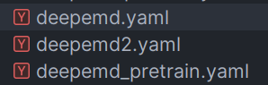
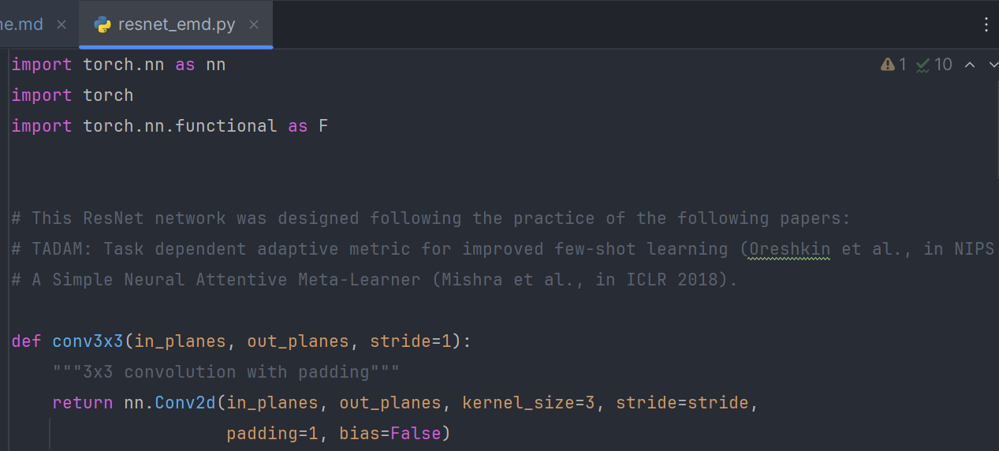
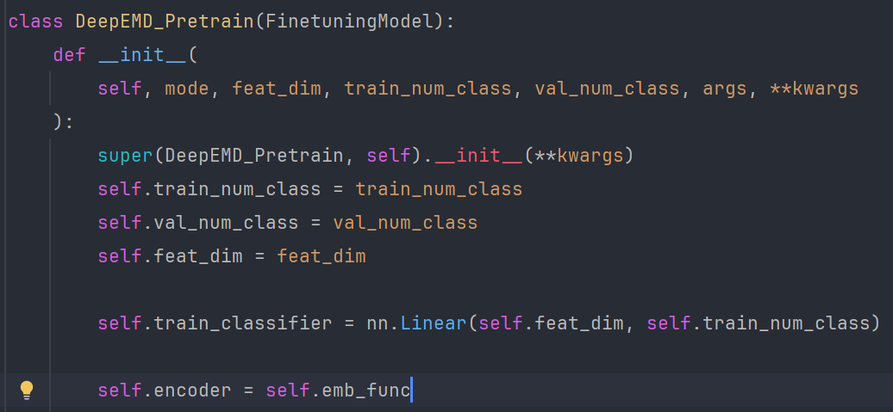
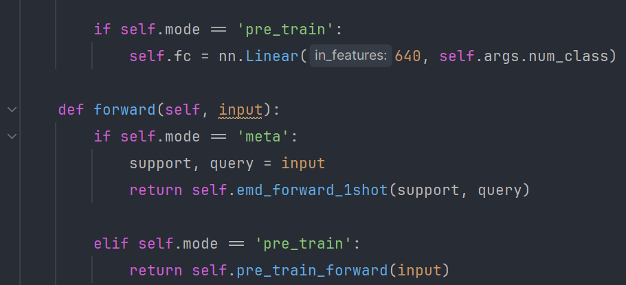
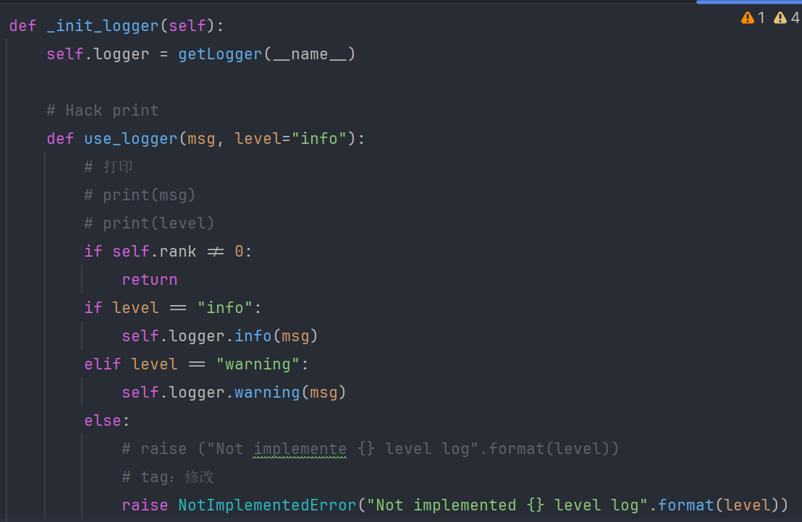

# 框架代码改写原始算法

> 其中一个代码仓库地址
>
> [shengyuand/deepemd (gitee.com)](https://gitee.com/shengyuand/deepemd)

## config

 

deepemd_pretrain.yaml是预训练用的配置文件

deepemd.yaml是使用metric-based训练方法进一步训练的配置文件


## core/backbone/resnet_emd.py

deepemd所使用的backbone基本就是resnet12，但是有点细微的区别，因此实现了resnet_emd.py




## core/model/finetuning/deepemd_pretrain.py

参考feat_pretrain实现了原论文的pretrain

提取为deepemd_pretrain.py

### 关键部分1：注意重排

set_forward函数中需要对数据进行重排，~~否则准确率会死的很惨~~

上述的结论已经通过**在deepEmd源代码中去除重排相关的部分**论证过了。重排后，按照标签，数据的格式应该形如012340123401234……（重排之前是000……111……222……333……444……）

后续的deepemd.py方法中也需要注意这一点

关键代码如下，已加上注释

```python
    def set_forward(self, batch):
        """
        :param batch:
        :return:
        """
        data, global_target = batch
        # print('global_targey:', global_target)

        # 打印data的shape 5*(1+16)张3,84,84 C H W
        # print('data.shape:', data.shape)

        # key: 重新排列数组
        # 重排数据
        new_data = torch.empty((data.size(0), data.size(
            1), data.size(2), data.size(3)), dtype=data.dtype)

        # 重新排列数据
        for i in range(self.args.way):
            for j in range(self.args.shot + self.args.query):
                if j < self.args.shot:
                    new_index = j * self.args.way + i
                else:
                    new_index = self.args.shot * self.args.way + \
                        (j - self.args.shot) * self.args.way + i
                new_data[new_index] = data[i *
                                           (self.args.shot + self.args.query) + j]

        data = new_data.to(self.device)

        k = self.args.way * self.args.shot

        self.deepemd_layer.mode = 'encoder'
        data = self.deepemd_layer(data)

        # print('batch.image:', batch.image)
        # print('batch.image.shape:', batch.image.shape)
        # print('batch.label:', batch.label)
        # print('batch.label.shape:', batch.label.shape)

        data_shot, data_query = data[:k], data[k:]
        self.deepemd_layer.mode = 'meta'
        if self.args.shot > 1:
            data_shot = self.deepemd_layer.get_sfc(data_shot)

        num_gpu = 1  # tag:先固定了
        logits = self.deepemd_layer(
            (data_shot.unsqueeze(0).repeat(num_gpu, 1, 1, 1, 1), data_query))

        # 012340123401234...
        label = torch.arange(
            self.args.way, dtype=torch.int8).repeat(self.args.query)
        label = label.type(torch.LongTensor)
        label = label.to(self.device)

        acc = accuracy(logits, label)

        # print('acc:', acc)

        return logits, acc
```

以上是一个重排的例子，但是这么做显然的会增加一些时间成本。从而，考虑到上述问题，我们进行了一些修改，选择将重排直接在sampler中进行（这里可以考虑写一个针对性的采样器，但是我们考虑到实现的优先性，选择如下修改）：

```python
class CategoriesSampler(Sampler):
    """A Sampler to sample a FSL task.

    Args:
        Sampler (torch.utils.data.Sampler): Base sampler from PyTorch.
    """

    def __init__(
        self,
        label_list,
        label_num,
        episode_size,
        episode_num,
        way_num,
        image_num,
    ):
        """Init a CategoriesSampler and generate a label-index list.

        Args:
            label_list (list): The label list from label list.
            label_num (int): The number of unique labels.
            episode_size (int): FSL setting.
            episode_num (int): FSL setting.
            way_num (int): FSL setting.
            image_num (int): FSL setting.
        """
        super(CategoriesSampler, self).__init__(label_list)

        self.episode_size = episode_size
        self.episode_num = episode_num
        self.way_num = way_num
        self.image_num = image_num

        label_list = np.array(label_list)
        self.idx_list = []
        for label_idx in range(label_num):
            ind = np.argwhere(label_list == label_idx).reshape(-1)
            ind = torch.from_numpy(ind)
            self.idx_list.append(ind)

    def __len__(self):
        return self.episode_num // self.episode_size

    def __iter__(self):
        """Random sample a FSL task batch(multi-task).

        Yields:
            torch.Tensor: The stacked tensor of a FSL task batch(multi-task).
        """
        batch = []
        for i_batch in range(self.episode_num):
            classes = torch.randperm(len(self.idx_list))[: self.way_num]
            for c in classes:
                idxes = self.idx_list[c.item()]
                pos = torch.randperm(idxes.size(0))[: self.image_num]
                batch.append(idxes[pos])
            if len(batch) == self.episode_size * self.way_num:
                batch = torch.stack(batch).t().reshape(-1)
                yield batch
                batch = []
```

这个类里面只改了这行语句：

```python
                batch = torch.stack(batch).t().reshape(-1)
```

该语句的目的是进行转置，从而得到前述排列的数据。

如果加入这一行之后，前面所述的classifier中的相关代码就可以删掉了。

以上就是一个非**常关键的修改**。

### 关键部分2：train_classifier



这里的self.train_classifier是实现了源代码中在network里的这部分预训练时期的分类




## core/model/metric/deepemd.py

参考手册完成这部分代码的迁移即可，一样注意上述的重排问题


## 框架代码的修改？



似乎这里有点小问题，不过无伤大雅
